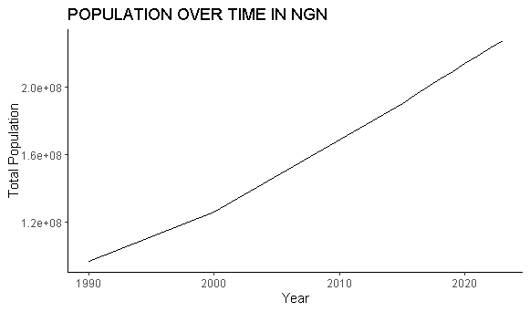

## World Bank Data- Country analysis Nigeria

## This data is purely for learning as I aimed to improve my Data Cleaning, Manipulation, and Visualization skills. 

## Data set
The data is in Excel for your view [Download here](https://1drv.ms/x/c/fc11b36f16d1a624/EaHQQL3K7gdGnQeR0lP2plkB8Wrh4va4MEcR5VV8oQ6mYg?e=QFpFBB)

## Tools
R Programming- for manipulation, Cleaning, and Visualization 

## Little bit of code 
~~~(r)
nigeria_data<- World_bank %>%
  filter(`Country Name`=="Nigeria")
selected_criteria <- c("Population, total",
         "Population growth (annual %)",
         "Surface area (sq. km)",
         "Poverty headcount ratio at national poverty line",
         "GDP (current US$)",
         "GDP growth (annual %)")
nigeria_data_filter<-nigeria_data %>% 
  filter(`Series Name` %in% selected_criteria)

nigeria_long<-nigeria_data_filter %>% 
  pivot_longer(cols=5:16,
               names_to = "Year",
               values_to = "Values") %>% 
              mutate(Year= as.numeric(str_extract(Year, "\\d{4}")))
View(nigeria_long)
~~~
### ANALYSIS FINDINGS 
The data took into account the growth of Nigeria's Gross Domestic Product, GDP per capita, and Population growth from 1990 to 2023
The population has been on a steady rise from 1990 to 2023, even considering the COVID-19 outbreak from the graph below we see consistency in the increase in Nigeria's population.
 
 

